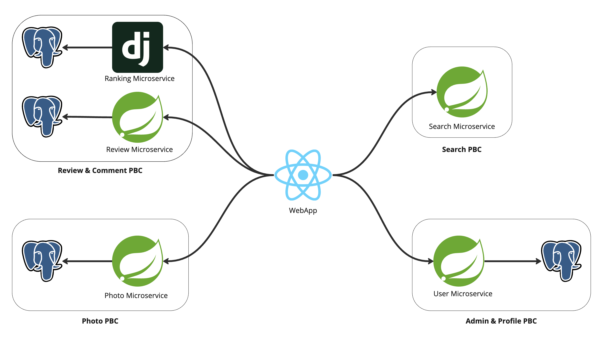

# Itinera Backend Microservices



Itinera is a composable application designed for searching and reviewing restaurants, bars, and other venues. The backend is built using a microservices architecture, with each service handling specific functionalities.

## 🏗️ Architecture Overview

The backend consists of 5 microservices, each responsible for a specific domain:

### 1. Profile Service (`profilePBC`)
- Handles business profile management
- User authentication and registration
- Business information storage and retrieval
- Profile updates and modifications
- Built with Spring Boot and Java

### 2. Search Service (`SearchPBC`)
- Manages venue search functionality
- Provides city-based filtering
- Returns business listings with ratings
- Integrates with other services to provide complete search results
- Built with Spring Boot and Java

### 3. Review Service (`reviewPBC`)
- Handles review creation and management
- Stores and retrieves user reviews
- Integrates with the ranking service for vote calculations
- Manages review metadata
- Built with Spring Boot and Java

### 4. Photo Service (`photoPBC`)
- Manages photo uploads and storage
- Handles both business profile photos and review photos
- Provides photo retrieval endpoints
- Built with Spring Boot and Java

### 5. Ranking Service (`rankingPBC`)
- Calculates and maintains business ratings
- Aggregates votes from reviews
- Provides ranking information to other services
- Built with Python

## 🛠️ Technology Stack

- **Languages**: Java, Python
- **Frameworks**: 
  - Spring Boot (Java services)
  - Django (Python service)
- **Database**: PostgreSQL
- **Authentication**: JWT-based authentication
- **API Communication**: REST APIs
- **Cross-Origin**: CORS enabled for frontend integration

## 📦 Installation

Each microservice can be run independently. Follow these steps to set up the development environment:

1. Clone the repository:
```bash
git clone [repository-url]
cd be-itinera
```

2. Set up the database:
```bash
# Create PostgreSQL database and run migrations
```

3. Configure environment variables for each service:
```bash
# Set up application.properties or application.yml files
# Configure database connections
# Set up service URLs for inter-service communication
```

4. Build and run each service:
```bash
# For Java services
./mvnw clean install
./mvnw spring-boot:run

# For Python service
pip install -r requirements.txt
python manage.py runserver
```

## 🔄 Service Communication

The services communicate with each other through REST APIs. Each service exposes specific endpoints that other services can consume. The main communication patterns are:

- Profile Service ↔ Search Service: Business information retrieval
- Review Service ↔ Ranking Service: Vote aggregation
- Photo Service ↔ Profile/Review Services: Photo management
- Search Service ↔ All Services: Aggregated search results

## 🐳 Docker Support

Each service includes a Dockerfile for containerization. To build and run the services using Docker:

```bash
# Build images
docker build -t itinera-profile ./profilePBC
docker build -t itinera-search ./SearchPBC
docker build -t itinera-review ./reviewPBC
docker build -t itinera-photo ./photoPBC
docker build -t itinera-ranking ./rankingPBC

# Run containers
docker-compose up
```

## 🧪 Testing

Each service includes its own test suite. Run tests for each service:

```bash
# For Java services
./mvnw test

# For Python service
python manage.py test
```

## 📝 API Documentation

Each service exposes its own API endpoints. The main endpoints are:

- Profile Service: `/api/profile/*`
- Search Service: `/api/search/*`
- Review Service: `/api/review/*`
- Photo Service: `/api/photo/*`
- Ranking Service: `/api/ranking/*`

## 🤝 Contributing

1. Fork the repository
2. Create your feature branch (`git checkout -b feature/amazing-feature`)
3. Commit your changes (`git commit -m 'Add some amazing feature'`)
4. Push to the branch (`git push origin feature/amazing-feature`)
5. Open a Pull Request


## 👥 Authors

- Domenico Lorenti

## 🙏 Acknowledgments

- Thanks to all contributors and mentors who helped in the development of this project
- Special thanks to the academic institution for supporting this thesis project 